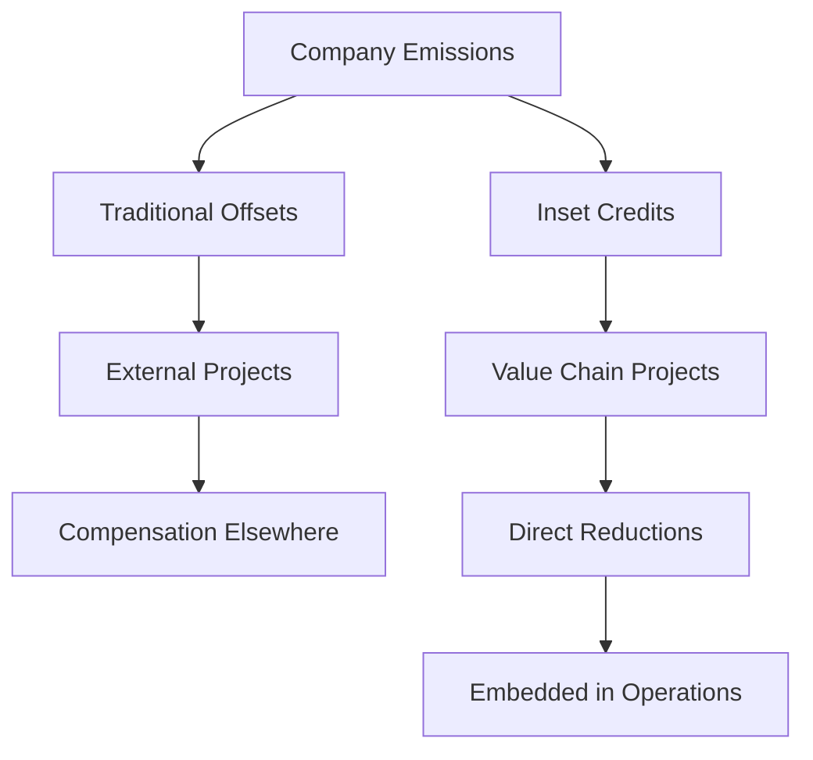
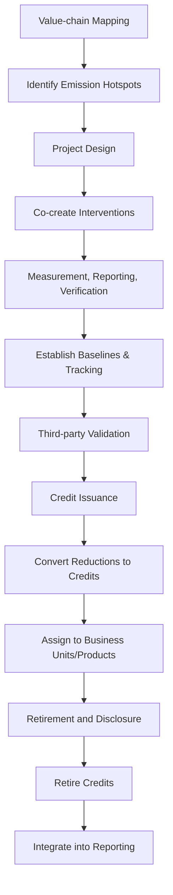
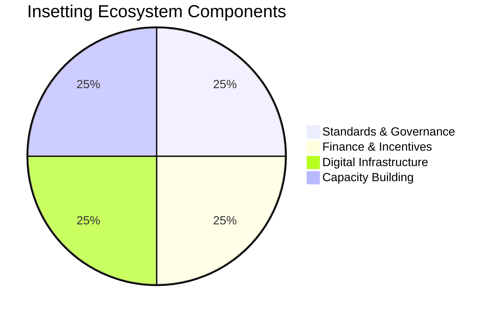

# Insetting

Insetting embeds emissions reductions and removals directly within a company's value chain, rather than compensating for emissions elsewhere. The goal is to transform core operations and supplier relationships so that climate and business benefits reinforce one another. By investing in on-the-ground projects with suppliers, customers, logistics partners, or downstream users, organizations create durable emission cuts that advance climate goals, strengthen resilience, and enhance traceability.

## Inset Credits Explained

Inset credits (sometimes called supply-chain carbon credits) quantify verified emission reductions generated within the boundary of a company's supply chain. Unlike traditional offsets—which are external to the purchaser's value chain—inset credits:

- **Align incentives:** Capital flows directly to suppliers and partners that can decarbonize shared processes.
- **Enhance traceability:** Data and measurement remain in the same supply network, simplifying monitoring, reporting, and verification.
- **Deliver co-benefits:** Projects often improve product quality, supply security, and social outcomes alongside emissions reductions.
- **Avoid double-counting:** Credits are tied to specific value-chain actors, reducing the risk that multiple entities claim the same reduction.

Inset credits still require robust methodologies, rigorous measurement, third-party validation, and transparent governance. Leading frameworks such as the International Platform for Insetting (IPI) and Gold Standard's Value Chain Initiatives provide emerging guidance.

## Why Insetting Outperforms Offsetting for Decarbonization

1. **Direct operational leverage:** Emissions reductions occur where the organization has influence, enabling systemic change rather than compensatory accounting.
2. **Supply-chain resilience:** Investments improve efficiency, resource use, and climate resilience, reducing long-term costs and risks.
3. **Regulatory readiness:** Insetting builds auditable data on scope 3 reductions, supporting disclosure regimes (e.g., CSRD, SEC) and preparing for carbon border adjustments.
4. **Stakeholder trust:** Customers, investors, and employees perceive insetting as more authentic than buying external offsets, mitigating greenwashing accusations.
5. **Innovation flywheel:** Collaborative projects accelerate new technologies (e.g., regenerative inputs, electrified transport) that can scale across industries.

## Industry Spotlights

- **Agriculture & Food:** Regenerative farming practices, agroforestry, and methane-reducing feed additives lower scope 3 emissions while boosting soil health and farmer livelihoods. Dairy companies like Danone partner with producers to capture methane via anaerobic digesters, generating inset credits that correspond to the milk supply chain.
- **Manufacturing & Materials:** Steelmakers collaborate with upstream iron ore suppliers to deploy hydrogen-based direct reduced iron (DRI) and invest in onsite renewable electrification. Automotive OEMs finance recycled aluminum loops with casting partners, cutting embedded carbon in vehicle components.
- **Energy & Utilities:** Integrated power companies work with equipment vendors to decarbonize supply chains through low-carbon materials, circular refurbishment programs, and electrified maintenance fleets. Utilities insetting within rooftop solar or community storage projects capture reductions that benefit their own distribution networks.
- **Logistics & Transportation:** Retailers co-invest with carriers to transition to battery-electric or bio-LNG trucks on dedicated lanes, capturing the resulting emission drops as inset credits tied to their freight volumes. Airlines develop sustainable aviation fuel (SAF) purchase agreements with fuel suppliers, aligning inset credits to their passenger routes.
- **Fashion & Apparel:** Brands collaborate with textile mills and cotton producers to adopt regenerative agriculture, renewable thermal energy, and water recycling. Verified reductions become inset credits attached to specific product lines, providing scope 3 transparency for consumers and regulators.
- **Technology & Electronics:** Electronics manufacturers engage component suppliers to power operations with renewables, implement circular design, and recover critical minerals. The emission savings are issued as inset credits mapped to product SKUs, improving lifecycle assessments.

## Methodology in Practice

1. **Value-chain mapping:** Identify hotspots in upstream and downstream emissions, prioritizing segments where collaborative projects can deliver measurable reductions.
2. **Project design:** Co-create interventions with partners—such as regenerative agriculture, process fuel switching, waste-to-value pathways, or product redesign.
3. **Measurement, Reporting, and Verification (MRV):** Establish baselines, implement digital tracking (IoT, remote sensing, blockchain-backed ledgers), and commission third-party validation.
4. **Credit issuance:** Convert verified reductions into inset credits, assign them to specific business units or products, and document claims per established standards.
5. **Retirement and disclosure:** Retire inset credits within corporate accounts to avoid resale, integrate data into sustainability reporting, and ensure auditability.

## Building the Insetting Ecosystem

- **Standards & Governance:** Harmonized protocols from IPI, SBTi's FLAG guidance, and sector-specific coalitions establish integrity and comparability.
- **Finance & Incentives:** Blended finance, supplier pre-financing, and long-term purchasing contracts de-risk investments for smaller value-chain partners.
- **Digital Infrastructure:** Traceability platforms, granular emissions accounting, and interoperable registries maintain transparency and prevent double counting.
- **Capacity Building:** Training for suppliers, cooperatives, and local communities ensures equitable participation and long-term project success.

Insetting transforms decarbonization from an external transaction into a shared operational mandate. It strengthens supply chains, accelerates innovation, and delivers climate impact where it matters most—within the systems that create products and services. The future of credible corporate climate action is inset, embedded, and accountable.

## Further Reading

- [Carbon Insetting: Historical Trends and Future Opportunities](Articles/Insetting-Historical-Trends-and-Future-Opportunities.md)
- [Insetting for Hard-to-Abate Sectors](Articles/Insetting-Hard-to-Abate-Sectors.md)