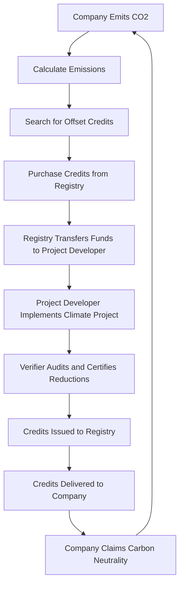
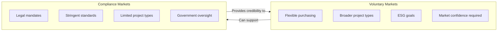

# Offsetting

Offsetting is the practice of compensating for greenhouse gas emissions by funding projects that either avoid emitting an equivalent amount of carbon dioxide or remove it from the atmosphere. Organizations and individuals use offsets to balance their carbon ledgers when direct emission reductions are difficult or costly. Properly structured offsetting can buy time for deeper decarbonization strategies, but it demands rigorous standards to deliver real-world climate benefits.

## Carbon Offset Credits

Carbon offset credits represent quantified emission reductions or removals, typically measured in metric tons of carbon dioxide equivalent (tCO2e). Each credit should correspond to a verifiable climate benefit that is:

- **Additional:** The project would not have happened without the revenue from selling credits.
- **Permanent:** The carbon benefit persists for the agreed time horizon without being reversed.
- **Measurable and verified:** A recognized methodology and third-party audit confirm the impact.
- **Unique:** Credits are serialized to prevent double counting across registries.

Common project categories include renewable energy deployment, avoided deforestation, methane capture, soil carbon practices, and engineered removals such as direct air capture with geological storage.

## Carbon Markets: Voluntary vs. Compliance

### Voluntary Carbon Markets

Voluntary markets allow corporations, institutions, and individuals to purchase offsets without a legal mandate. They provide flexibility to pursue broader climate or ESG goals, pilot new methodologies, and support early-stage climate solutions. However, voluntary markets rely on market confidence—buyers must trust the integrity of standards, registries, and project developers.

### Compliance Carbon Markets

Compliance (or regulated) markets operate under government-imposed caps or obligations. Entities covered by cap-and-trade systems or carbon taxes can use approved offsets to meet part of their legal requirements. These markets typically feature stringent accreditation, limited eligible project types, and tight monitoring to ensure environmental integrity while maintaining policy objectives.

## Persistent Issues with Offsetting

Despite its promise, offsetting faces structural challenges that can undermine credibility and impact:

- **Greenwashing risk:** Some organizations prioritize offset purchases over direct emissions cuts, using credits to bolster climate claims without making substantive operational changes.
- **Verification gaps:** Not all standards or audits catch flawed baselines, exaggerated benefits, or permanence risks, leading to credits that do not represent real reductions.
- **Tracing and transparency hurdles:** Fragmented registries and opaque ownership records make it difficult to track credits across multiple buyers, increasing double-counting risk and eroding trust.

These issues necessitate continual improvements in governance, data quality, and stakeholder accountability.

## Beyond Offsetting

What if climate strategies focused on transforming value chains instead of compensating after the fact? Enter carbon insetting—a far superior methodology poised to redefine how companies invest in emissions reductions. Stay tuned.

# Offsetting Process Flow

This circular flowchart illustrates the offsetting cycle, where achieving neutrality enables continued operations that may generate new emissions.

## Offset Project Categories

This diagram categorizes common types of carbon offset projects and their subcategories.

## Voluntary vs. Compliance Markets

This diagram compares the characteristics of voluntary and compliance carbon markets.